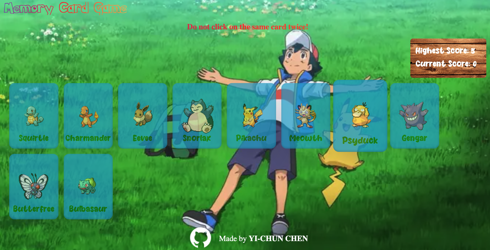

# Memory Card Game - Test Your Memory with React!

Welcome to the Memory Card Game, a fun and challenging way to test your short-term memory abilities. Built with React, this game will keep you engaged as you strive to avoid clicking the same card twice. Can you become the ultimate memory master?

## Table of Contents

- Demo
- Technologies Used
- Features
- Credits

## Demo

Check out the [**live**](https://stupendous-chebakia-89b31c.netlify.app) demo.

## Technologies Used

- React: Building the interactive user interface and game logic.
- External API: Fetching card images and informational text to make the game dynamic and engaging.
- CSS: Styling the application to create an attractive and user-friendly interface.

## Features

- Employ **React's state** management to handle dynamic information within components, ensuring efficient updating and rendering.
- Employ **React effects** to dynamically respond to events based on relevant dependency variables, enhancing interactivity and user experience.
- Cards are shuffled using simple **algorithm** every time user clicks one.
- Engage with a variety of cards featuring images and information fetched from an **external API**.
- Incorporate **animations** to seize and hold user attention, making interactions and transitions visually appealing.
- Infuse visual variety by integrating **external fonts**, enhancing the aesthetics of the application's design.
- Improve theme color maintenance by implementing **custom properties**, streamlining design adjustments and updates.
- **Responsive Web Design**

## Credits

- The Odin Project: [Memory Card](https://www.theodinproject.com/lessons/node-path-react-new-memory-card)

- [ICONS8](https://icons8.com/icons)

- [Pokemon api](https://pokeapi.co/)

- Font: [dafont](https://www.dafont.com/)

- Webfont generator: [font squirtle]:(https://www.fontsquirrel.com/tools/webfont-generator)

- [Background image](https://www.eurogamer.net/ash-ketchums-final-pokemon-episodes-will-air-on-netflix-in-september)

- Gif: [giphy](https://giphy.com/gifs/pokemon-pikachu-ash-XN88vs2jKnmdW)
